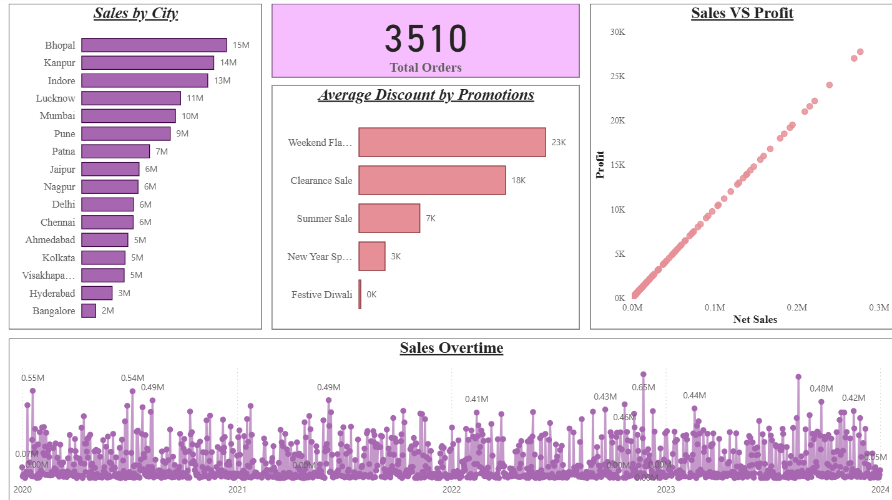
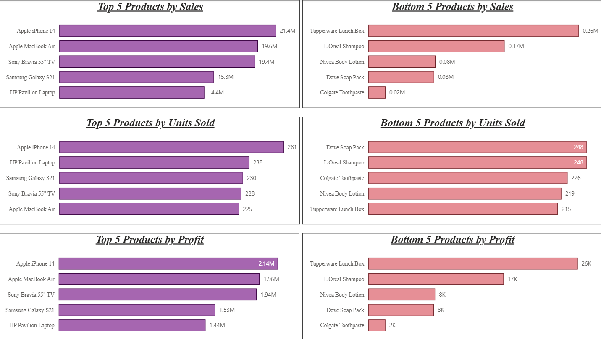
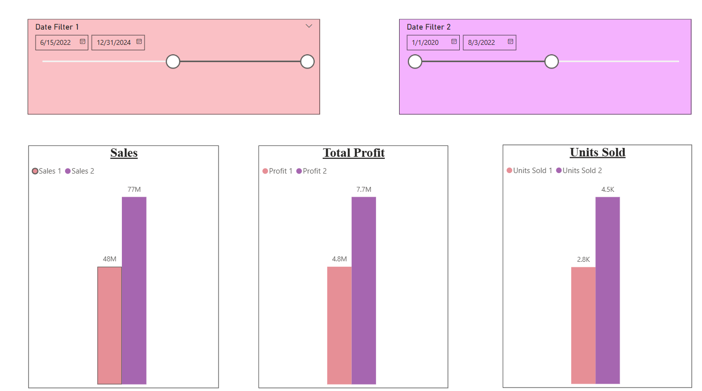

# Sales Data Analysis Report (Power BI)

## 📌 Project Title  
Sales Data Analysis Dashboard

## 📖 Description  
This project provides an interactive **Power BI dashboard** for analyzing store sales data.  
The report highlights key insights into sales performance, product distribution, and customer behavior.  
Its purpose is to help business stakeholders track revenue, identify trends, and make data-driven decisions.  

Key questions answered include:  
- What are the total sales and revenue trends?  
- Which products contribute most to revenue?  
- How do sales vary across different regions or stores?  
- What time periods show peak sales performance?  

## 📊 Data Sources  
- **Dataset:** `Store Data.xlsx`  
- **Report File:** `Sales DB.pbix`  
- Source: Provided structured Excel dataset containing store sales records.  

## 🔑 Key Features & Visualizations  
The Power BI report includes the following analyses:  
1. **Top/Bottom 5 Products** – By Sales, Profit, and Quantity Sold.  
2. **Sales Trends Over Time** – Daily, monthly, quarterly, and annual views.  
3. **Sales vs. Profit Relationship** – Scatter plots or comparative charts.  
4. **Period Comparison** – Compare Sales/Profit/Quantity Sold between two user-selected periods.  
5. **Discount Analysis** – Average discount by category.  
6. **Order Metrics** – Total number of orders tracked.  
7. **Order-Level Details** – Sales, Profit, Discount, Net Sales, and other fields filterable by Product, Date, Customer ID, or Promotion Category.  
8. **Regional Insights** – Sales by city.
9.   

## 📷 Report Snapshots    

 Product Analysis 
 
 Sales and Profit Overtime

## 🚀 How to Use  
1. Download the `.pbix` file from this repository.  
2. Open it in **Power BI Desktop**.  
3. Connect with the included `Store Data.xlsx` dataset if required.  
4. Explore the interactive dashboards and filters.  

## 🛠️ Tools Used  
- **Power BI Desktop** (for data visualization and dashboard creation)  
- **Excel** (for dataset preparation and cleaning)
